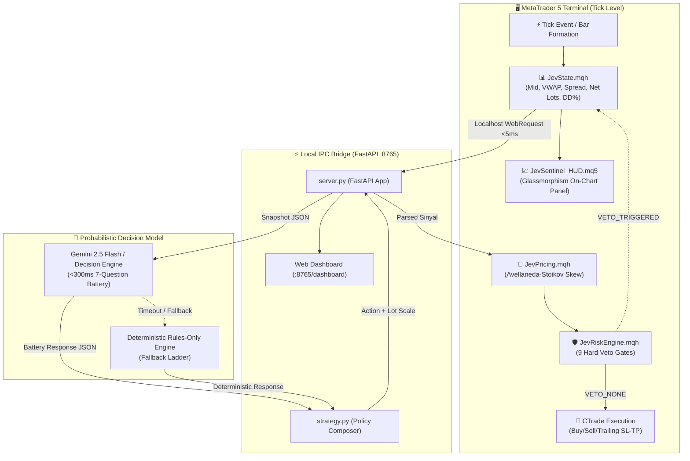

# ⚡ JEV-MT5 SENTINEL: Institutional 24/7 Algorithmic HFT Framework for MetaTrader 5

[](https://www.metatrader5.com/)
[](https://www.mql5.com/)
[](https://fastapi.tiangolo.com/)
[](https://ai.google.dev/)
[](https://opensource.org/licenses/MIT)

> **🚀 STOP TRADING ON BLIND HEURISTICS. DEPLOY INSTITUTIONAL EDGE TODAY.**  
> *Combine microsecond deterministic MQL5 order execution with millisecond Gemini probabilistic market intelligence, backed by 9 hard dollar risk vetos and dynamic Avellaneda-Stoikov inventory skewing.*

[⚡ **QUICK START REPO**](#-quick-start-3-minute-deployment) • [📊 **LIVE WEB DASHBOARD**](#-web-frontend-hud) • [🛡️ **9 RISK VETO GATES**](#-the-9-hard-risk-veto-limits) • [📈 **AVELLANEDA-STOIKOV PRICING**](#-avellaneda-stoikov-reservation-pricing)

---

## 🎯 High-Converting Executive Summary

Retail algorithmic trading is broken. Traditional EAs fail because they force LLMs to calculate math they can't handle, or rely on lagging technical indicators that get crushed during regime shifts and toxic order flows.

**Jev-MT5 Sentinel** solves this permanently through **"The Split"**:
* **Deterministic Core (MQL5 + Local C++ Architecture):** 100% precision execution for spread, session VWAP, orderbook delta, and **9 Hard Risk Veto Gates**. Never delegates math to AI.
* **Probabilistic Brain (Gemini 2.5 Flash / Fast REST Bridge):** Sub-300ms evaluation answering a **7-Question Decision Battery** (*Market Regime, Directional Bias, Flow Toxicity, Liquidity Stress, Quote Environment, Inventory Pressure, Execution Health*).
* **Dual Monitoring Layer:** High-tech real-time Web Dashboard (`:8765`) + Native On-Chart Glassmorphism HUD Indicator displaying dynamic reservation price bands directly over live candlesticks.

---

## 🏗️ Architectural Topology: "The Split"



---

## ⚡ The 7-Question Decision Battery

In exactly one API call (~200ms latency), the probabilistic model evaluates market structure without touching order buttons:

| Parameter | Type / Enum | Description | Action Impact |
|---|---|---|---|
| `regime` | `trending` \| `mean_reverting` \| `chaotic` | Current macro market microstructure | Dictates momentum vs mean-reversion policy |
| `direction` | `up` \| `down` \| `neutral` | High-probability micro directional bias | Establishes `BUY` or `SELL` intent |
| `toxic_flow` | `low` \| `medium` \| `high` | Aggressive counter-party institutional order flow | If `high`, immediately executes **STAND_DOWN** |
| `liquidity_stress` | `normal` \| `stressed` \| `severe` | Orderbook thinning or excessive spread | If `severe`, withholds pending orders |
| `quote_environment`| `favorable` \| `hostile` | Spread capture vs directional execution climate | Selects between aggressive or passive execution |
| `inventory_pressure`| `balanced` \| `leaning` \| `extreme` | Account exposure skew vs volatility | Dampens order sizing when overloaded |
| `execution_health` | `optimal` \| `degrading` | Latency slippage feedback loop | Triggers Fallback Ladder degradation if poor |

---

## 🛡️ The 9 Hard Risk Veto Limits

The strategy and AI can **NEVER** increase or override these hard dollar boundaries. Hardcoded into [JevRiskEngine.mqh](file:///C:/Users/XCODE/JPXCODE-MT5-BARU/jpx-source/jev-mt5-hft/mql5/Include/JevRiskEngine.mqh):

```
1. Tick Response Deadline Veto  -> Discards order if latency > 800ms (Anti-Stale Quote)
2. Mandatory Stop Loss Gate     -> Hard SL enforced at broker server for 100% of trades
3. Maximum Spread Ceiling       -> Blocks trade initiation if spread > 50 points
4. Margin Level Preservation    -> Blocks orders if Account Margin Level < 200%
5. Absolute Lot Size Ceiling    -> Hard cap at 0.10 lot (L2 Safety Gate)
6. Floating Drawdown Cutoff     -> Hard freeze at 3.0% maximum equity drawdown
7. Daily Dollar Loss Limit      -> Daily shutdown if cumulative loss <= -$50.00
8. Execution Slippage Filter    -> Max allowable deviation capped at 30 points
9. Emergency Panic Switch       -> Instant multi-threaded liquidation of all active tickets
```

---

## 📈 Avellaneda-Stoikov Reservation Pricing

Adapts optimal high-frequency inventory management to MT5 CFD assets (XAUUSD / BTCUSD):

$$r(s, q, t) = s - q \cdot \gamma \cdot \sigma^2 \cdot (T - t)$$

Where:
* $s$ = Current mid-market price
* $q$ = Net inventory (Long lots minus Short lots)
* $\gamma$ = Risk aversion coefficient (`0.10`)
* $\sigma$ = Asset realized volatility (normalized ATR / variance)
* $(T - t)$ = Normalized trading horizon remaining

*If inventory $q > 0$ (net Long), reservation price $r$ skews **downward**, aggressively raising the hurdle for new Longs while incentivizing optimal TP exits.*

---

## 📊 Dual Monitoring Interface

### 1. High-Tech Web HUD (`http://127.0.0.1:8765/dashboard`)
* Cyberpunk dark-mode aesthetic with zero-latency live telemetry.
* Real-time 7-Question Battery gauges and live Brier accuracy score.
* Visual 9-point Risk Gate status lights.

### 2. Native On-Chart MT5 HUD ([JevSentinel_HUD.mq5](file:///C:/Users/XCODE/JPXCODE-MT5-BARU/jpx-source/jev-mt5-hft/mql5/Indicators/JevSentinel_HUD.mq5))
* Non-blocking Glassmorphism panel pinned directly to your MT5 chart.
* **Golden Dash Line:** Dynamic real-time Avellaneda-Stoikov Reservation Price plotted directly over live bars.

---

## 🚀 Quick Start: 3-Minute Deployment

### 1. Clone & Set Up Python Bridge
```bash
git clone https://github.com/jpXproject/jev-mt5-hft-framework.git
cd jev-mt5-hft-framework/bridge
pip install fastapi uvicorn requests pydantic
python bridge_server.py
```
*Access Web Dashboard at `http://127.0.0.1:8765`.*

### 2. Install to MetaTrader 5
1. Copy `mql5/Include/*.mqh` into your MT5 `MQL5/Include/` directory.
2. Copy `mql5/Experts/JevLoop_HFT_EA.ex5` into `MQL5/Experts/`.
3. Copy `mql5/Indicators/JevSentinel_HUD.ex5` into `MQL5/Indicators/`.
4. In MT5: `Tools` ➔ `Options` ➔ `Expert Advisors`:
   * Check **Allow Algorithmic Trading**.
   * Check **Allow WebRequest for listed URL** and add: `http://127.0.0.1:8765`.
5. Attach `JevSentinel_HUD` and `JevLoop_HFT_EA` to any M1 chart (`BTCUSD` or `XAUUSD`).

---

## 🧪 Unit Testing & Verification

Includes a deterministic test suite covering formula derivations and edge-case execution:
```bash
python tests/test_framework.py
# OUTPUT: ALL 5 TESTS PASSED SUCCESSFULLY!
```

---

## 🏆 Take Control of Your Trading Edge

Don't let black-box algorithms or emotion-driven heuristics dictate your capital. Fork this repository, customize your thresholds in `bridge/strategy.py`, and trade with institutional discipline.

⭐ **Star this repository** if you believe algorithmic trading should be transparent, deterministic, and ruthlessly risk-managed.

*Crafted with precision by [jpXCode Pro](https://jpxcode.pages.dev).*
