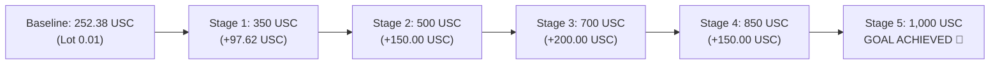

# 🎯 BLUEPRINT RECOVERY ROADMAP: 252.38 USC ➡️ 1,000.00 USC
**jpXCode Jev-MT5 Quantitative Algorithmic Trading Framework**  
*Simbol: XAUUSDc (Gold Cent) | Broker: Exness Real 36 | Baseline Terkini: 252.38 USC | Target: 1,000.00 USC*

---

## 1. Parameter Utama & Metrik Pemulihan (Recovery Baseline)

| Metrik | Nilai / Spesifikasi | Keterangan |
| :--- | :--- | :--- |
| **Saldo Baseline Saat Ini** | **252.38 USC** | Akun Riil Exness #257549152 |
| **Target Saldo Akhir** | **1,000.00 USC** | Target Recovery Utama |
| **Kekurangan Saldo (Delta)** | **+747.62 USC** | Total Net Profit Kumulatif |
| **Persentase Pertumbuhan Target** | **+296.23%** | Model Pertumbuhan Bertahap (Compounded Staging) |
| **Model Risiko** | **L2 Conservative Fixed Fraction** | Risiko per trade $\le 0.6\%$ saldo |
| **Risk to Reward (R:R)** | **1 : 1.7 ~ 1 : 2.5** | SL 850-1,200 pts vs TP 1,500-2,500 pts |
| **Perkiraan Total Siklus Trade** | **~110 - 120 Posisi** | Dengan Target Win Rate $\ge 65\%$ |

---

## 2. Peta Tahapan Pemulihan 5 Tingkat (5-Stage Tiered Execution)

Ukuran lot tidak boleh dinaikkan secara sembarangan, melainkan **hanya naik otomatis saat saldo akun riil melampaui batas stage**:

### Tabel Rincian 5-Stage Recovery:

| TAHAPAN (STAGE) | RENTANG SALDO | LOT DINAMIS | TARGET PROFIT TAHAP | EST. NET WINS | SL / TP AVERAGE | MAKS. RISIKO PER TRADE |
| :--- | :--- | :--- | :--- | :--- | :--- | :--- |
| **Stage 1: Rebound & Stabilisasi** | `252.38 ➡️ 350.00 USC` | `0.01 Lot` | **+97.62 USC** | ~25 trades | SL 850 pts / TP 1,500 pts | 1.00 - 1.50 USC (<0.6%) |
| **Stage 2: Pondasi Konservatif** | `350.00 ➡️ 500.00 USC` | `0.01 Lot` | **+150.00 USC** | ~33 trades | SL 900 pts / TP 1,600 pts | 1.50 - 2.00 USC (<0.5%) |
| **Stage 3: Akselerasi Momentum** | `500.00 ➡️ 700.00 USC` | `0.02 Lot` | **+200.00 USC** | ~25 trades | SL 1,000 pts / TP 1,800 pts | 3.00 - 3.50 USC (<0.5%) |
| **Stage 4: Penetrasi Target** | `700.00 ➡️ 850.00 USC` | `0.02 Lot` | **+150.00 USC** | ~18 trades | SL 1,000 pts / TP 2,000 pts | 3.50 - 4.00 USC (<0.5%) |
| **Stage 5: Final Target Run** | `850.00 ➡️ 1,000.00 USC` | `0.025 / 0.03 Lot` | **+150.00 USC** | ~13 trades | SL 1,200 pts / TP 2,500 pts | 5.00 USC (<0.5%) |
| **GOAL COMPLETED 🎯** | **1,000.00 USC** | `0.01 (Lockdown)` | **+747.62 USC** | **~114 Trades** | - | **Auto Flatten / Capital Preservation** |

---

## 3. Disiplin Operasional & Proteksi Akun

1. **Anti-Martingale / Zero Revenge Trading:**
   - Tidak ada pelipatan lot setelah posisi kalah. Ukuran lot selalu kembali ke spesifikasi Stage berjalan.
2. **Buffer Spread Terjaga:**
   - SL minimum selalu disetel di atas 850 poin (0.85 USD) untuk mencegah posisi tertebas oleh spread broker (~260 poin).
3. **Breakeven Profit Locking:**
   - Begitu running profit mencapai $\ge +400$ poin (+4.00 USC pada 0.01 lot), Stop Loss otomatis digeser ke $+80$ poin untuk mengunci profit minimal.
4. **Daily Cutoff / Veto Drawdown:**
   - Maksimum toleransi kerugian harian dipatok pada $15.00$ USC. Jika tercapai, AI Co-Pilot berhenti otomatis selama 4 jam.

---

## 4. Pelacakan Real-Time

- **Live Web Dashboard:** `http://127.0.0.1:8765`
- **Rumus Progres Live:**
  $$\text{Progress (\%)} = \frac{252.38}{1,000.00} \times 100\% = \mathbf{25.24\%}$$
- Dashboard menampilkan progress bar terintegrasi yang ter-update otomatis tiap 250ms.
