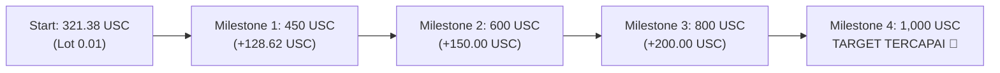

# 🎯 BLUEPRINT RECOVERY ROADMAP: 321.38 USC ➡️ 1,000.00 USC
**jpXCode Jev-MT5 Quantitative Algorithmic Trading Framework**  
*Simbol: XAUUSDc (Gold Cent) | Broker: Exness Real 36 | Baseline Awal: 321.38 USC*

---

## 1. Parameter Utama & Metrik Pemulihan

| Metrik | Nilai / Spesifikasi | Catatan |
| :--- | :--- | :--- |
| **Saldo Baseline Saat Ini** | **321.38 USC** | Akun Riil #257549152 |
| **Target Saldo Akhir** | **1,000.00 USC** | Target Recovery Milestone |
| **Kekurangan Saldo (Delta)** | **+678.62 USC** | Total Net Profit yang dibutuhkan |
| **Persentase Pertumbuhan** | **+211.16%** | Pertumbuhan bertahap (Compounding) |
| **Model Risiko** | **L2 Conservative Fixed Fraction** | Max risk per trade $\le 1.0\%$ |
| **Risk to Reward (R:R)** | **1 : 1.4 ~ 1 : 1.8** | SL 260-350 pts vs TP 380-600 pts |
| **Perkiraan Total Siklus Trade** | **~100 - 120 Posisi** | Dengan target Win Rate $\ge 65\%$ |

---

## 2. Tahapan Eksekusi Bertahap (4-Stage Tiered Milestones)

Untuk menjaga akun terhindar dari Margin Call atau Drawdown ekstrem, ukuran lot **hanya dinaikkan secara bertahap setelah setiap checkpoint tercapai secara nyata**:

### Rincian Tiap Milestone:

#### 🟢 TAHAP 1: Foundation Building (321.38 ➡️ 450.00 USC)
- **Ukuran Lot:** `0.01 Lot` (Strict minimum).
- **Target Profit Tahap:** `+128.62 USC`.
- **Rata-rata Profit per Win:** `+3.50` s/d `+4.50 USC`.
- **Target Kemenangan Bersih:** ~32 trades kemenangan bersih.
- **Max Risiko per Trade:** `1.00 - 2.50 USC` (<0.8% balance).
- **Fokus:** Menjaga drawdown di bawah 3%, mengunci modal awal.

#### 🟡 TAHAP 2: Conservative Acceleration (450.00 ➡️ 600.00 USC)
- **Ukuran Lot:** `0.01` s/d `0.02 Lot`.
- **Target Profit Tahap:** `+150.00 USC`.
- **Rata-rata Profit per Win:** `+5.00` s/d `+7.00 USC`.
- **Target Kemenangan Bersih:** ~25 trades kemenangan bersih.
- **Max Risiko per Trade:** `3.00 USC` (<0.6% balance).

#### 🟠 TAHAP 3: Scaling Momentum (600.00 ➡️ 800.00 USC)
- **Ukuran Lot:** `0.02 Lot`.
- **Target Profit Tahap:** `+200.00 USC`.
- **Rata-rata Profit per Win:** `+7.50` s/d `+10.00 USC`.
- **Target Kemenangan Bersih:** ~22 trades kemenangan bersih.
- **Max Risiko per Trade:** `4.50 USC` (<0.6% balance).

#### 🔴 TAHAP 4: Target Final Run (800.00 ➡️ 1,000.00 USC)
- **Ukuran Lot:** `0.02` s/d `0.03 Lot`.
- **Target Profit Tahap:** `+200.00 USC`.
- **Rata-rata Profit per Win:** `+10.00` s/d `+14.00 USC`.
- **Target Kemenangan Bersih:** ~18 trades kemenangan bersih.
- **Pencapaian:** Target 1,000 USC tercapai. Sistem otomatis mengunci margin dan mengembalikan ke mode konservatif flat.

---

## 3. Matriks Manajemen Risiko & Veto Hard Limits

1. **Daily Max Loss Limit (Circuit Breaker):**
   - Jika dalam 1 hari mengalami kerugian kumulatif $\ge 15.00$ USC, AI Co-Pilot **wajib pause transaksi selama 4 jam**.
2. **Spread Spike Veto:**
   - Tidak ada order yang dieksekusi jika spread emas $> 350$ poin (misal saat berita high-impact CPI / FOMC).
3. **Breakeven Lock Engine:**
   - Setiap posisi yang mengambang profit $\ge +150$ poin (+1.50 USC) secara otomatis digeser SL-nya ke $+40$ poin untuk menjamin **Risk-Free Trade**.
4. **Zero Overtrading Policy:**
   - Jeda minimal antar-posisi adalah 25 detik setelah posisi sebelumnya ditutup untuk menghindari false whip-saw.

---

## 4. Pelacakan Telemetri & Dashboard

Progres persentase menuju 1,000 USC dilacak langsung di:
- **Web Dashboard:** `http://127.0.0.1:8765`
- **Rumus Progres:** $\text{Progress (\%)} = \frac{\text{Current Balance}}{1000.00} \times 100\%$
  - Saldo saat ini 321.38 USC = **32.14% Menuju Target 1,000 USC**.
